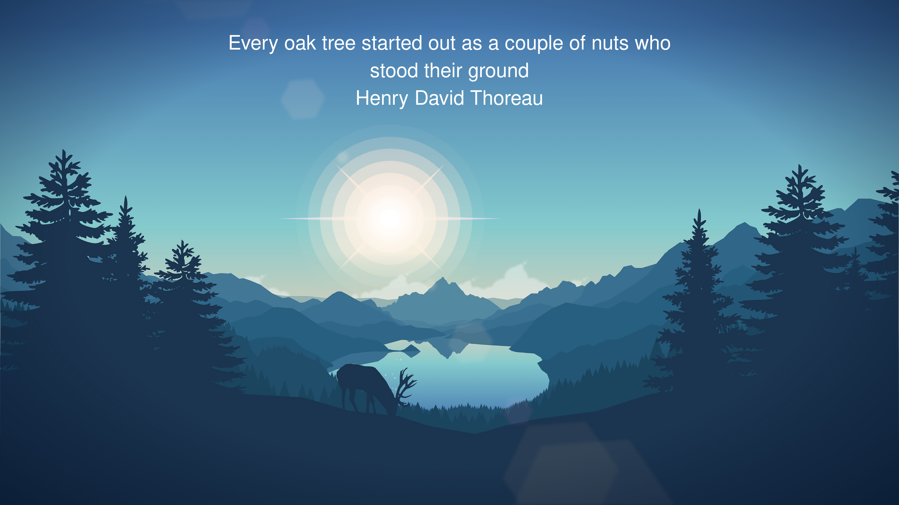

# random_desktop_quote

Generates a daily wallpaper by pairing an image from `assets/wallpapers` and a quote from `data/quotes.json`

# Quick Start

## To Use This Wallpaper

`task sync` will pull todays wallpaper from the github repository. Daily wallpaper should be generated at midnight. `task set` will set the wallpaper as the background (only works as written on gnome).

Run `task install` to setup pull daily wallpaper on startup and on 6am morning cron.

## Use My Own Wallpapers

To use your own wallpapers and quotes, you can fork the repo change the source `src/sync_wallpaper.sh` pulls the image from.

To run locally only, update `install.sh` to have cron and startup run `src/create_wallpaper.sh` rather than `src/sync_wallpaper.sh`. You can grab the code from `task create` to run this in a docker container.

# Today's Wallpaper



# Quotes Schema

Schema to use for quote entries in the `quotes.json` file. All values other than `quote` and `author` have a default in `create_wallpaper.sh` and can be ommitted.

```json
{
  "type": "object",
  "description": "quotes.json schema",
  "properties": {
    "quote": {
      "type": "string",
      "description": "Specifies the quote to print",
      "exclusiveMinimum": 0,
    },
    "author": {
      "type": "string",
      "description": "Specifies the author for the quote",
      "exclusiveMinimum": 0,
    },
    "fileRegex": {
      "type": "string",
      "description": "Defines the regex to filter wallpapers to select from. If unspecified, selects from all",
    },
    "wordsPerLine": {
      "type": "int",
      "description": "Defines words printed per line on the wallpaper. If unspecified, uses default",
    },
    "fontSize": {
      "type": "int",
      "description": "Defines the font size to be used. If unspecified, uses default. See https://imagemagick.org/script/command-line-options.php#pointsize",
    },
    "font": {
      "type": "string",
      "description": "Defines the font to print in. If unspecified, uses default. See https://imagemagick.org/script/command-line-options.php#font",
      
    },
    "fontColor": {
      "type": "string",
      "description": "Defines the color for the font to be printed in. If unspecified, uses default. See https://imagemagick.org/script/command-line-options.php#fill",
    },
    "gravity": {
      "type": "string",
      "description": "Defines the base location to print text on the wallpaper. If unspecified, uses default (North). See https://imagemagick.org/script/command-line-options.php#gravity",
    },
    "annotate": {
      "type": "string",
      "description": "Defines the location adjustment for font location to be printed. If unspecified, uses default. See https://imagemagick.org/script/command-line-options.php#annotate",
    },
  },
  "required": [ "quote", "author" ],
}
```

:warning:  Just because a field can be changed doesn't mean it should

# Acknowledgements

```json
[
  {
    "wallpapers": "landscape*.png",
    "author": "Louis Coyle",
    "source": "https://louie.co.nz/25th_hour/",
  },
  {
    "wallpapers": "buddha.png",
    "author": "Phil Distress",
    "source": "https://www.deviantart.com/phildistress/art/Moonlight-Meditation-811660312",
  },
  {
    "wallpapers": "iroh*.png",
    "author": "Damion Mauville",
    "source": "https://www.deviantart.com/damionmauville/gallery/63670706/avatar-wallpapers",
  },
  {
    "wallpapers": "cross.png",
    "author": "gstudioimagen",
    "source": "https://www.vecteezy.com/photo/24622803-christian-cross-on-majestic-mountain-   peak-at-sunset-generative-ai",
  },
  {
    "wallpapers": "dune.png",
    "author": "Illustrated Vectors",
    "source": "https://www.deviantart.com/illustratedvectors/art/Sand-Dune-Mojave-899873021",
  },
]
```
